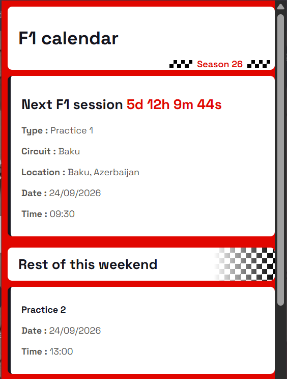

# Formula one calendar chrome extension

I've been into F1 since 2020, and sometimes while studying or working I just forget about the schedule — too lazy to google and check every time. So I 
built this extension for myself: click it, see the next session and countdown, 
done. It's also been a genuine learning project along the way since it's my first time making a chrome extension.

## Features
- Live countdown to next session
- Full remaining weekend schedule (remaining sessions)
- Handles cancelled sessions
- Local caching (not to overload the API for no reason)
- Graceful handling during live sessions (since OpenF1's real-time data needs a paid tier)

## Screenshots

## Built with
Vanilla JS, HTML, CSS, Manifest V3, OpenF1 API.

## Handling live sessions

OpenF1 restricts real-time data (from 30 minutes before a session starts 
until 30 minutes after it ends) to a paid tier so outside that window, data 
is free and open.

I had an issue with this when i tried querying during a live session it threw a CORS 
error, which was confusing. After debugging a bit, i concluded that the cause
was the API rejecting the request for the live-data restriction imposed by openF1.

So to avoid this error and paying for a subscription, i made the extension check
cached "next session" against the current time using the same 30-minute 
rule OpenF1 documents, and if it falls within that live window, it skips 
the fetch altogether and shows a simple status (starting soon / in progress 
/ wrapping up) using data already cached from before the session went live.

## Installation 
- clone the repo locally via git clone.
- open chrome click on extensions.
- turn developer mode on then click on load unpacked.
- select the folder that contains manifest.json.
- pin the extension then click on it and you're done.

## License
This project is licensed under the MIT License — see LICENSE for details.